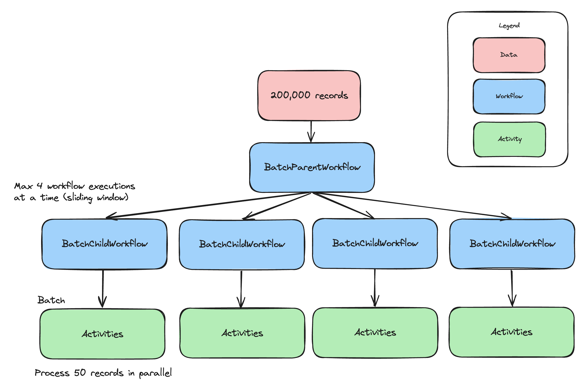

# Batch Processing Sample

Takes a list of words (words_alpha.txt) and processes them (converts them to uppercase) in batches of 50. Each batch is processed in parallel executing child workflows. A maximum of 4 child workflows can be executed in parallel.



## Configuration

The sample is configured by default to connect to a [local Temporal Server](https://docs.temporal.io/cli#starting-the-temporal-server) running on localhost:7233.

To instead connect to Temporal Cloud, set the following environment variables, replacing them with your own Temporal Cloud credentials:

```bash
TEMPORAL_ADDRESS=testnamespace.sdvdw.tmprl.cloud:7233
TEMPORAL_NAMESPACE=testnamespace.sdvdw
TEMPORAL_CERT_PATH="/path/to/file.pem"
TEMPORAL_KEY_PATH="/path/to/file.key"
````

## Run a Workflow

Start a worker:

```bash
./gradlew -q execute -PmainClass=io.temporal.samples.batchprocessing.Worker -Parg=8085
```

Heck, run a whole bunch of workers (you'll need a bunch to keep [sync match rate](https://community.temporal.io/t/suggested-metrics-to-autoscale-temporal-workers-on/5870/3) high): 
```bash
# -Parg is the metrics port number to listen on
# mkdir output first!
for i in {8085..8100}; do 
    ./gradlew -q execute -PmainClass=io.temporal.samples.batchprocessing.Worker -Parg=$i < /dev/null > "output/temporal_batch_output_$i.txt" 2>&1 &
done
wait
```

`killall java` to stop all workers and callers.

Start an execution (the `arg` parameter is the number of records to process):

```bash
# process 20000 records (warning: takes 15+ minutes to finish executing)
./gradlew -q execute -PmainClass=io.temporal.samples.batchprocessing.Caller -Parg=200000
```

## Set up SDK Metrics

Download Prometheus.

Create a `prometheus.yml` file in the Prometheus directory with the following:

```yaml
global:
  scrape_interval: 1s # Set the scrape interval to every 15 seconds. Default is every 1 minute.
  evaluation_interval: 1s # Evaluate rules every 15 seconds. The default is every 1 minute.

scrape_configs:
  - job_name: 'temporal-workers'
    static_configs:
      - targets: [
          "localhost:8076", "localhost:8085", "localhost:8086", "localhost:8087", "localhost:8088", 
          "localhost:8089", "localhost:8090", "localhost:8091", "localhost:8092", "localhost:8093", 
          "localhost:8094", "localhost:8095", "localhost:8096", "localhost:8097", "localhost:8098", 
          "localhost:8099", "localhost:8100"
        ]
```

Run Prometheus:

```bash
./prometheus --config.file=prometheus.yml
```

Open your browser and go to http://localhost:9090 to verify that Prometheus is running and monitoring the Temporal workers on the specified ports.

## Tweak Configuration

`BatchParentWorkflowImpl.java` contains

```
    // process x records in a single batch (parallel activity executions)
    private static final int BATCH_SIZE = 50;

    // run up to x child workflows in parallel
    private static final int WINDOW_SIZE = 4;

    // continue as new every x workflow executions (to keep event history size small)
    private static final int CONTINUE_AS_NEW_THRESHOLD = 500;
```

`Worker.java` contains
```
    // set activities per second across *all* workers
    // prevents resource exhausted errors

    WorkerOptions options =
        WorkerOptions.newBuilder().setMaxTaskQueueActivitiesPerSecond(150).build();
```